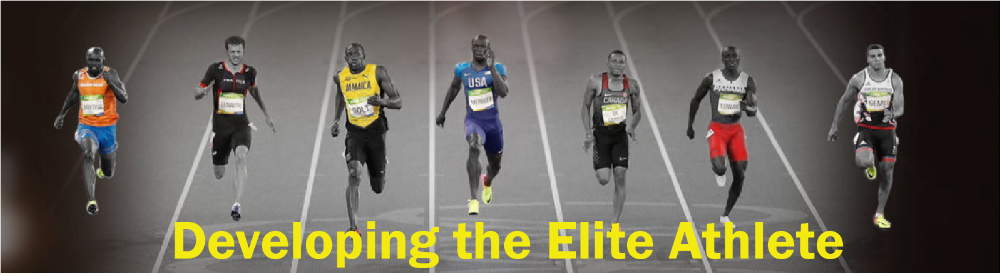

{width="100%"}

---

## Coordinator note

Welcome to SPCG3343 - Developing the elite athlete! I'm excited for the semester ahead and look forward to your contributions to the learning community.

I recommend taking time to explore this course site that contains the majority of the content. Assessments will be submitted and quizzes completed via the [blackboard site](https://learn.uq.edu.au). I would also encourage you to use the Discussion Forums on the Blackboard site where you can discuss the course material with me, the tutors and your fellow students.

Of course please make sure you read the [ECP](https://my.uq.edu.au/programs-courses/course.html?course_code=SPCG3343). Please look through the material that we will cover each week, and get an understanding of the assignments you'll need to complete. 

If you have questions about course content, please post them in the forums to get help from others in the course community. For technical problems with the Coursera platform, visit the Learner Help Center.

All the best and I hope you enjoy the course! 

An athlete once said:

> *"Athletes never, ever
> cheat."*

---
### Exercise 

<iframe width="100%" height=1200 src="https://danielrivera1.shinyapps.io/Regression2/?_ga=2.168099425.1356426571.1594781329-530285595.1587375686" frameborder="0" allowfullscreen></iframe>
*Here's a simple exercise with an empty code chunk provided for entering the answer.*

Write the R code required to add two plus two:

```{r two-plus-two, exercise=TRUE}

```


## test section
[A learnr tutorial](https://appforiarteam.shinyapps.io/PlayR/#section-data-manipulation)
